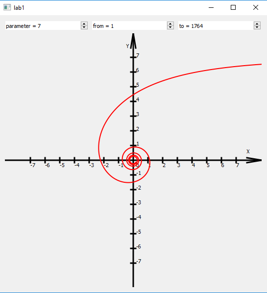
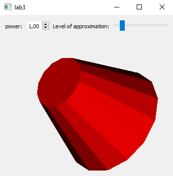
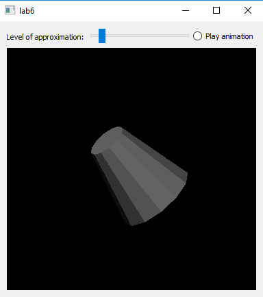
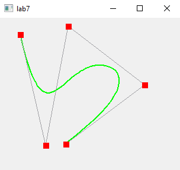

## Лабораторные работы по курсу компьютерная графика

- lab1 — Построение графиков функций в полярной системе координат с использованием drawLine.

    

- lab2 — Построение 3D-фигуры с удалением невидимый плоскостей и отрисовкой теней. Разрешается использовать только функции для отрисовки линий и закрашивания областей.

    

- lab3 — Построение 3D-фигуры средствами OpenGL.

    

- lab4 — Построение B-сплайна с использованием drawLine.

    

